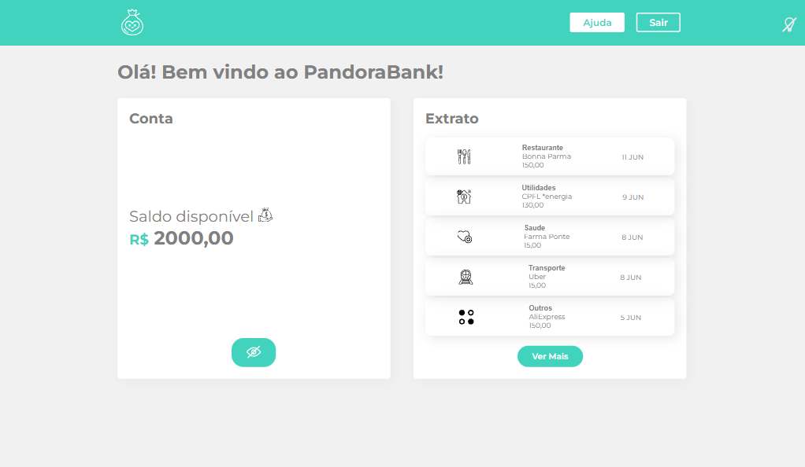

# Site do Pandora Bank

Página criada acompanhando um curso sobre a utilização dos Styled Components com React

## Conteúdo deste Readme:

- [Resumo](#resumo)
  - [O Desafio](#o-desafio)
  - [Screenshot](#screenshot)
  - [Deploy](#deploy)
- [Meu processo](#meu-processo)
  - [Projetado com](#projetado-com)
  - [O que eu aprendi](#o-que-eu-aprendi)
- [Autores](#autores)

## Resumo

### O Desafio

O objetivo do projeto era implementar os styled components ao código, facilitando a manutenção do mesmo e deixando menos engessado.

Vantagens dos Styled Components:

- Os componentes são renderizados juntamente com a página;
- Os nomes das classes são gerados automaticamente;
- Todo o CSS fica no arquivo JavaScript;
- Estilização dinâmica;
- O estilo que está sendo alterado corresponde somente ao componente que o importa;

### Screenshot

#### Imagem da página inicial do site

